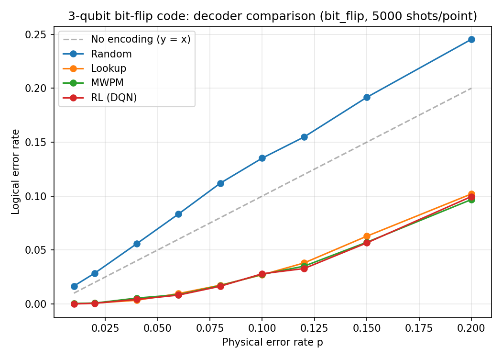

# RL_QS2_Project

Reinforcement learning decoder for the 3-qubit bit-flip quantum error correction code. Trains a DQN agent to decode syndromes and benchmarks it against Random, Lookup, and MWPM baselines across a sweep of physical error rates.

## Background

Quantum computing is a massive new approach to computing that stands to speed up and improve many current problems, but one major concept limits its scalability: errors. Current quantum computers have error rates of 0.1-1% per gate, and fault-tolerant industry-grade quantum computers require error rates of less than 0.01%. These errors cause decoherence in quantum circuits, making qubits lose their superpositions and entanglement due to environmental and hardware issues, preventing more complex operations and creating a bottleneck for quantum computation.

To address this, the 3-qubit bit-flip code encodes one logical qubit across three physical qubits, allowing single-qubit errors to be detected and corrected without destroying the quantum information. Two stabilizer measurements extract a 2-bit syndrome that identifies which qubit flipped, without measuring the logical value directly.

Current error correction methods rely on rule-based and algorithmic decoders that cannot adapt in real time as noise models become more complex. While surface codes support real-time syndrome extraction, streamlining the decoding process remains critical — classical decoders like MWPM scale poorly as code distance grows, and static thresholds will no longer be adequate as noise models continue to evolve. With the advancement of classical AI, we can utilize reinforcement learning over current quantum error correction systems to adapt and scale along with errors themselves. The RL agent observes the syndrome and learns a correction policy purely from reward signal — +1 if the logical value was preserved, -1 if a logical error occurred — without being given the syndrome table explicitly.

## Project structure

    RL_QS2_Project/
    ├── pyproject.toml
    ├── requirements.txt
    ├── src/qec_rl/
    │   ├── __init__.py
    │   ├── circuits.py      Qiskit encoding, noise, syndrome measurement
    │   ├── syndrome.py      Syndrome-to-correction logic, action constants
    │   ├── decoders.py      Decoder ABC, Random, MWPM, Lookup
    │   ├── env.py           Gymnasium RL environment
    │   ├── agent.py         DQN training and RLDecoder wrapper
    │   └── evaluate.py      Benchmark harness and plotting
    ├── tests/               pytest suite (160 tests, all passing)
    └── examples/            Runnable scripts and integration test

## Installation

Requires Python >= 3.10.

    git clone https://github.com/rohanmagesh/RL_QS2_Project
    cd RL_QS2_Project
    python3 -m venv .venv
    source .venv/bin/activate
    pip install -e ".[dev]"

## Quick start

    from qec_rl import NoiseConfig, RandomDecoder, MWPMDecoder, LookupDecoder
    from qec_rl.agent import train_dqn, RLDecoder
    from qec_rl.evaluate import run_benchmark, plot_benchmark

    train_dqn(save_path="models/dqn_qec.zip", total_timesteps=20_000, seed=0)

    result = run_benchmark(
        decoders=[
            RandomDecoder(),
            LookupDecoder(),
            MWPMDecoder(),
            RLDecoder("models/dqn_qec.zip"),
        ],
        shots_per_point=5000,
        seed=0,
    )
    print(result.to_table())
    plot_benchmark(result, save_path="results/comparison.png", show=True)

## Running the tests

    pytest
    pytest --cov=qec_rl --cov-report=term-missing
    pytest --ignore=tests/test_agent.py

## Integration smoke test

    python examples/integration_test.py

Expected: 30 checks, all PASS, exits 0.

## How it works

The 3-qubit bit-flip code encodes a logical qubit as |0>_L = |000> and |1>_L = |111>. Two stabilizers Z0Z1 and Z1Z2 detect errors via parity checks. The 2-bit syndrome uniquely identifies which qubit flipped.

    Syndrome 00 — no error, do nothing
    Syndrome 01 — qubit 2 flipped, flip qubit 2
    Syndrome 10 — qubit 0 flipped, flip qubit 0
    Syndrome 11 — qubit 1 flipped, flip qubit 1

The RL agent observes the syndrome as an integer in {0, 1, 2, 3} and selects one of four actions: do nothing, flip q0, flip q1, flip q2. It receives +1 for successful decoding, -1 for a logical error, and -0.01 per non-trivial action. Episodes are single-step.

## Reward structure

    base_reward = +1.0 if correction succeeds else -1.0
    action_cost = -step_penalty if action != ACTION_NONE else 0.0
    reward      = base_reward + action_cost

To ablate the step penalty:

    env = QECEnv(NoiseConfig("bit_flip", 0.1), step_penalty=0.0)
    env = QECEnv(NoiseConfig("bit_flip", 0.1), step_penalty=0.5)

## Decoders compared

    Random   — ignores syndrome, uniform random action (floor)
    Lookup   — canonical syndrome table (optimal for this code)
    MWPM     — PyMatching minimum weight perfect matching
    RL (DQN) — trained Q-network, should approach Lookup and MWPM

## Results

The plot below shows logical error rate vs physical error rate for all four decoders across a bit-flip noise sweep (5000 shots per point).

The random decoder fails badly — it sits above the y=x line meaning encoding actually makes things worse if you ignore the syndrome entirely. The three informed decoders (Lookup, MWPM, and RL) all stay well below the diagonal across every error rate tested, showing the encoding is doing its job.

The main result is that the RL agent matches Lookup and MWPM almost exactly. It was never given the syndrome table — it figured out the right correction for each syndrome through trial and error using only the +1/-1 reward signal. That said, this is expected on the 3-qubit code since there are only 4 possible syndromes and one right answer each. The real value of RL decoders is at scale, where MWPM gets slow and lookup tables become impossible.

## References

Fosel et al. (2018). Reinforcement learning with neural networks for quantum feedback. Physical Review X, 8(3), 031084.

Nautrup et al. (2019). Optimizing quantum error correction codes with reinforcement learning. Quantum, 3, 215.

## License

MIT